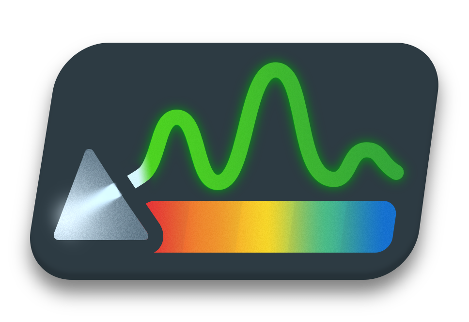

  <a href="https://github.com/brandonkthomas/Spectrometer">
    <picture>
      
    </picture>
  </a>

  <h3 align="center">Spectrometer</h3>

  

    Modern hardware monitor for Windows.
     
    <a href="https://github.com/brandonkthomas/Spectrometer/releases/latest/download/Spectrometer.exe">Download Latest Release</a>
     
     
    
    
  

## About the Project

Includes list view of all system sensors, customizable graph view, and various customization settings.

This project is incomplete; more features are planned for future implementation.
